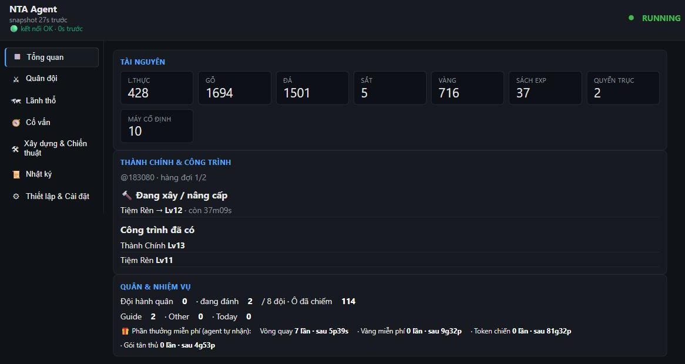
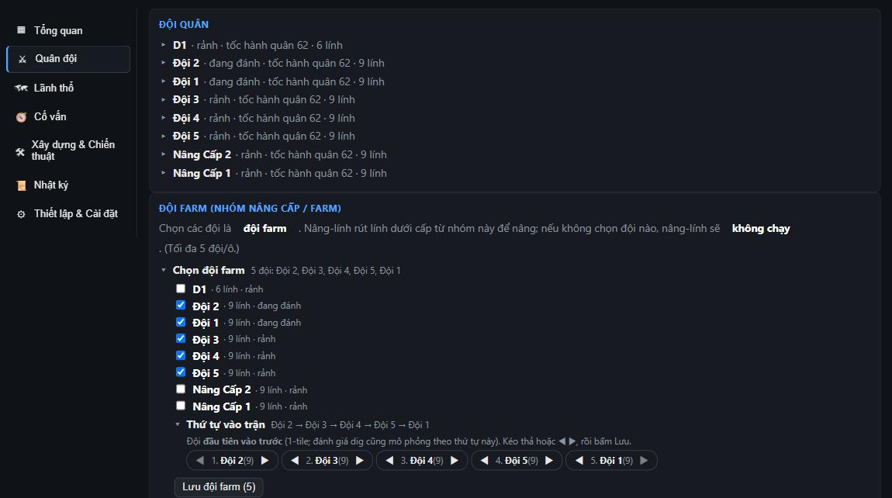
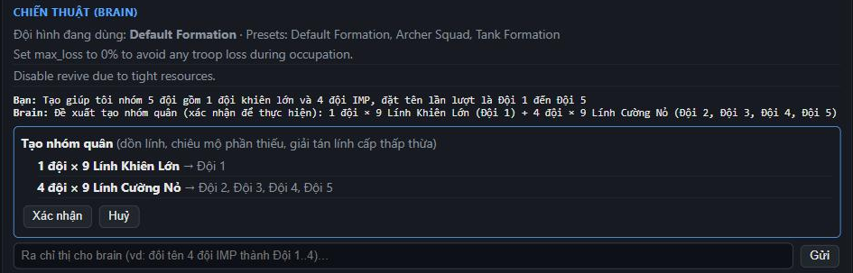
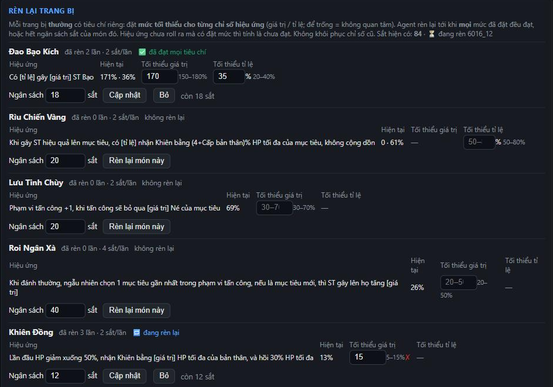
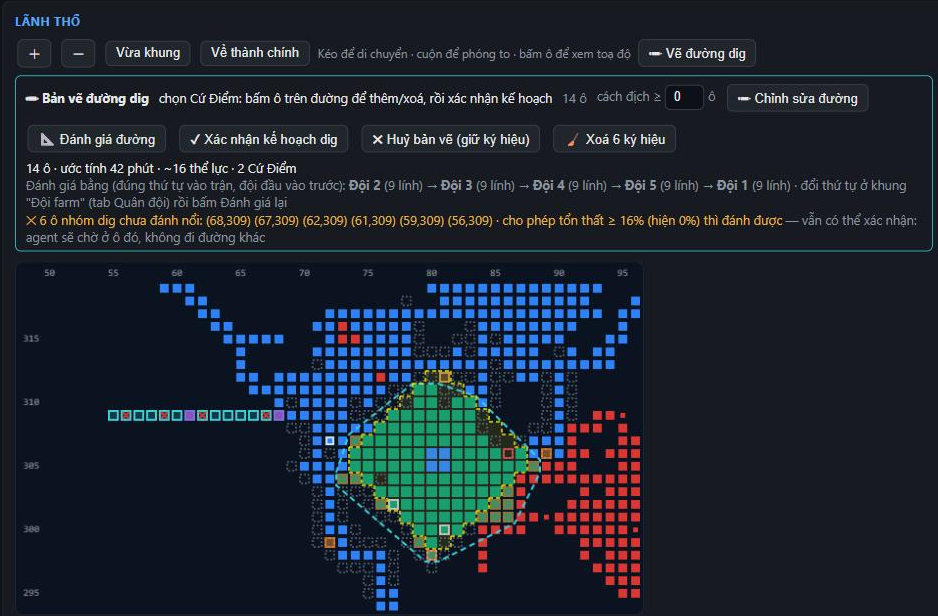
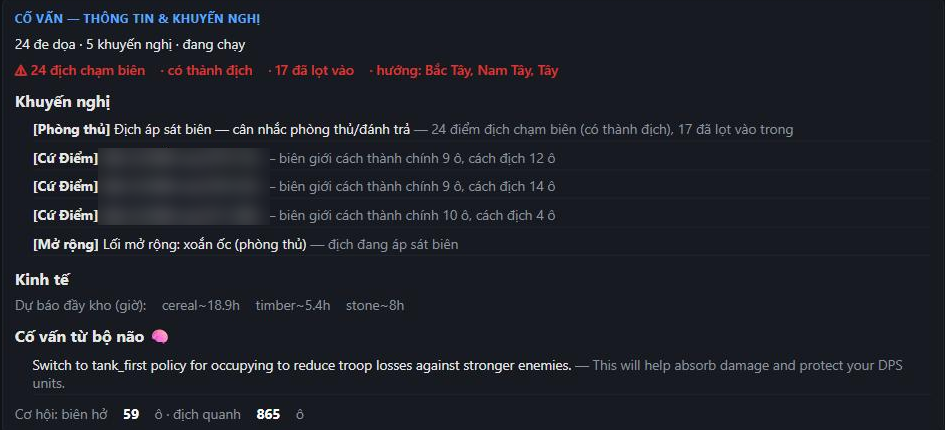
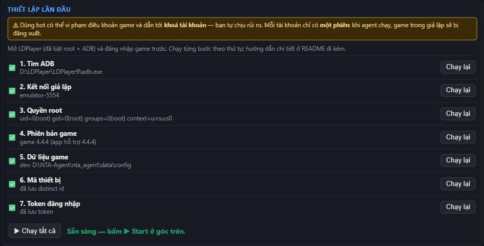

<div align="center">

[Tiếng Việt](README.md) · **English** · [中文](README.zh.md)

# NTA-Agent

**An auto-play assistant for _Ninety Thousand Acres_: it builds, expands territory, re-forges gear and assembles armies, all controlled from a browser dashboard.**

[](https://github.com/Relieq/NTA-Agent/releases/latest)




</div>

The agent talks **directly to the game server** (no screen tapping), so it is light and fast,
and you don't need the emulator running day to day. Every risky decision respects the limits
you set (e.g. "never lose troops").

> ⚠ **Risk:** using a bot may break the game's terms of service and get your **account banned**.
> Use it at your own risk.
>
> ⚠ **One session only:** while the agent runs, the game on your emulator/phone is logged out
> (and vice versa). Press **⏹ Stop** before playing yourself.

> ℹ The dashboard itself is in Vietnamese; this page explains what each part does.

---

## Features

### 🏰 Overview: resources, buildings, build queue
Tracks food, wood, stone, iron, gold… and upgrades buildings following **your build order**
(drag to reorder, tick to skip a building).

### ⚔ Armies and strike groups


- Occupies cells around your territory using **a simulation run on the game's own battle
  engine**: it attacks only when the predicted loss is within your limit. **Stamina only pays for
  the treasure chest**: at 0 stamina it keeps expanding (just no chest). Surrounded by allies is not a
  dead end either: cells touching an ally's land can be attacked too (the game's own rule).
- By default each farm army attacks **on its own** when it can win alone (fewest troops); the whole
  group goes out together only when one army isn't enough.
- Recruits, revives, tops up armies, and levels pawns with EXP books.
- **Leveling through buffer armies:** pick a group and a mode. The agent proposes buffer armies
  (reusing spare armies, merging, recruiting, books/time needed); you confirm. A buffer levels at the
  city, then meets the main army on an **adjacent cell** and **swaps same-type pawns** — the main group
  keeps farming/digging (one army short, it attacks only if still lossless). Each level-up also costs
  **cereal** (level factor × this match's base price, a few hundred), so the plain recruit rule leaves that
  cereal alone; the agent levels **only as many pawns per type as the farm group is short of** (a main army
  of 8 archers + 1 hunter levels one hunter, not a whole spare army).
- Pick **farm armies** for the agent to manage on its own. The **Thứ tự vào trận** (battle order) block
  (one collapsed line) reorders them by drag or ◀ ▶, then **Lưu**: the first army enters a 1-tile battle first,
  and the dig simulation follows the same order.

### 🧠 Chat with the "brain" (optional, needs an OpenAI key)


Give orders in plain language, e.g. _"Create a group of 5 armies: 1 heavy-shield army and
4 IMP armies, named Đội 1 to Đội 5"_. The brain proposes, **you press Confirm**, and only then
does the agent act: it pulls pawns out of mixed armies, recruits what's missing and names the
armies. Renaming armies and changing tactics also go through chat.

**Swapping pawns:** _"Swap 1 hunter from Đội 3 with the archer at the end of Đội 5"_. Three operations:
**swap** 2 pawns between two armies, **move** pawns to another (or a new) army, **reorder** pawns inside one
army. The agent picks the lowest-level pawns (or the first/last slot if you say so) and shows a confirm
card. The game only swaps between armies in the **same cell**: if they aren't, the agent calls them to a
cell on your land (the nearest meeting point, at most 5 armies per cell; an army about to attack stays put
and the other walks over) and then swaps. If the swap would break the running strike goal the card says so
and confirming cancels that goal. Army names you type must match real armies, otherwise the agent asks
instead of guessing.

### 🔨 Criteria-based equipment re-forging


Set a **minimum for each effect stat** (the rollable range is shown, e.g. 150–180%) and an
**iron budget** per item. The agent re-forges until every minimum is met, or stops when the
budget runs out. A newly **unlocked** item is crafted **before** the re-forge loop: if it still lacks
cereal/wood/stone/iron the loop pauses (re-forging spends those very things), and the panel says why
("crafting a new item…", "re-forge loop paused…").

**Exclusive equipment:** you pick it at slots 10/18 (with **this match's** random effect pool shown).
Once a wanted line meets its minimums the agent **locks** it and spends **fixators** (own budget) re-forging
the other line. **Smelting** stays yours: choose the vice equips, preview, confirm — the agent only sends that.

### 🗺 Territory and forts


A live territory map: owned cells, borders, enemies, and the suggested zone for building a
**fort** (click a cell and the agent builds it). Expansion follows a spiral or octopus
pattern depending on how close the enemy is.

**⛏ Dig along a path you draw:** press **✏ Vẽ đường dig**, hold the left button and **drag over the
cells** (start on your land or on a cell touching an ally's land; drag back to erase; Shift or right-drag pans).
1. **📐 Đánh giá đường (evaluate):** the agent scores every cell (terrain, someone else's land, too close
   to an enemy, cells the farm group can't win with the loss %, time, stamina) and **sends nothing to the
   game**. Redraw and re-evaluate as often as you like; the marks are remembered when you cancel or clear
   the drawing (**🧹 Xoá ký hiệu** drops them).
2. **✔ Confirm the path** → the agent proposes fort spots (~every 7 cells) → you add/remove them →
   **✔ Confirm the dig plan**.
3. The farm group digs **exactly your path, in your order**; a cell it can't win or that someone else took
   makes it **wait and tell you**, never detour. Other armies keep farming.

*Gợi ý đường tới đây* (suggest a path to any cell) is still there: the agent suggests one and you
**✏ edit** it before confirming. The simulation uses the farm group in its saved order (the evaluation
card names the group used) and re-simulates on every evaluation.

### 🎁 Tasks and free rewards
The agent claims **guide-task** rewards as soon as they're met (including the kinds the game judges on
the client side, like choosing a policy, forging gear or reaching a building level) and retries the open
ones every 5 minutes. It also collects, **claim-only and never buying anything** (no ingot spend, no ads):

- **Lucky wheel:** 10 free spins a day (plus any extra spins left), spaced by the cooldown the game reports.
- The shop's **free gold** and **free war token**, when their cooldown ends.
- **Newbie gift pack:** each due day (if you own a pack).

The schedule is kept in `run\free_rewards.json` and shown on the Overview tab (**🎁 Phần thưởng miễn phí**).

### 🧭 Advisor and alerts


Warnings when enemies approach, storage-full forecasts, defence recommendations. The agent
**records every battle where it lost troops** and replays it in the simulator to learn from it
(e.g. which army should lead).

### ⚙ 7-step, self-checking setup


Each step checks itself and tells you how to fix it if it fails. No need to install Python or
Node: they ship with the app.

---

## Installation (portable build)

1. Download **`NTA-Agent-<version>-full.zip`** from the [Releases page](https://github.com/Relieq/NTA-Agent/releases/latest).
2. Unzip it into a folder **you can write to**, e.g. `D:\NTA-Agent\` (not `C:\Program Files`).
3. Run **`NTA-Agent.exe`**. Your browser opens the dashboard at `http://127.0.0.1:8787`.
   - If Windows SmartScreen blocks it: **More info → Run anyway** (the app isn't code-signed).
   - If your antivirus blocks `NTA-Agent.exe`: use **`NTA-Agent.bat`**, which does exactly the same.
4. On first launch the dashboard opens the **Thiết lập & Cài đặt** (Setup & Settings) tab.
   Follow the 7 steps below. **▶ Start** stays locked until all 7 are ✅.

## Before you start

- **LDPlayer 9** (Android 9), from ldplayer.net. Only needed for setup; see [Daily use](#daily-use).
- **Ninety Thousand Acres** installed in LDPlayer, **the version this app supports** (step 4).
- (Optional) an **OpenAI API key** to enable the strategy "brain" and chat.

## Setup steps

In the Setup tab press **▶ Chạy tất cả** (Run all) or run each step. A failed ❌ step shows a
hint; fix it and press **Chạy lại** (Run again).

1. **Find ADB.** The app finds LDPlayer's `adb.exe` (usually `D:\LDPlayer\LDPlayer9\adb.exe`).
   Otherwise enter its path in Settings.
2. **Connect the emulator.** Start LDPlayer; in **LDPlayer settings → Other → ADB debugging**
   choose **Open local connection**. With several instances, enter the device (e.g.
   `emulator-5554`) in Settings. **LDPlayer 14** has no such option: **stop** the emulator,
   set `"basicSettings.adbDebug": 1` in `LDPlayer14\vms\config\leidian0.config`, then start it.
3. **Root.** **LDPlayer settings → Other → Root permission = On**, save and restart LDPlayer.
   Root is used to read the game's device id and login token (read-only).
4. **Game version.** Checks the installed game matches the version the app supports. If the
   game just updated, you may **Skip** (at your own risk) or wait for an app update.
5. **Game data.** The app ships **no** game data: it takes the game's APK **from your own
   emulator** and extracts the protocol, data tables and battle engine into your data folder.
   The decryption key is **found inside your copy of the game automatically**. Takes 10–30 s;
   stop the agent before re-running. Re-run after each game update.
6. **Device id.** Reads the id the game logs in with. If it fails, open the game once until the
   main screen, then retry.
7. **Login token.** In LDPlayer, open the game and **log in** (Google/Facebook…), then **close
   the game completely** and run this step (with the agent stopped).

When all 7 are ✅, press **▶ Start** at the top.

---

<a id="daily-use"></a>
## Daily use

### Do I need LDPlayer running?

**No.** The agent talks to the game server directly, so in normal use you can close LDPlayer
(saving ~1.7 GB of RAM).

The game's login token is single-use: every time the agent logs in, the server returns a new
one and the agent saves it for next time. Restarting the agent or the whole PC therefore
doesn't need LDPlayer.

You only need LDPlayer when:

| Situation | What to do |
|---|---|
| First setup, or after a game update | Run the Setup steps (step 5 re-extracts game data). |
| **The token chain breaks**, usually after you played the game yourself (emulator or phone) | If LDPlayer is open, the agent fetches a new token by itself. Otherwise it shows **CRASHED**: open LDPlayer, log in, close the game, re-run step 7, press Start. |
| You want to play yourself | **⏹ Stop** the agent first (only one session can be logged in). |

### Restarts

- **Restarting the dashboard:** the agent keeps running; the new dashboard re-attaches to it.
- **Restarting the PC:** nothing starts automatically. Run `NTA-Agent.exe` and press **▶ Start**;
  the agent logs in with the saved token.
- If the agent shows **CRASHED**, press **📄 Xem lỗi** (View error) next to Start.

### How much RAM does it use?

Measured on a Windows 11 PC:

| Component | RAM |
|---|---|
| Battle simulator (Node, runs the game's battle engine) | ~380 MB |
| Agent (Python) | ~45 MB |
| Dashboard (Python) | ~40 MB |
| **Total** | **~0.5 GB** |
| _(LDPlayer, when open)_ | _~1.7 GB, not needed day to day_ |

---

## Settings

| Setting | Meaning |
|---|---|
| OpenAI API key | Optional. Enables the brain and chat. Billed to your OpenAI account; **Kiểm tra OpenAI key** tests it for free. |
| Model / call limit | Pick a model from your OpenAI account's list (default `gpt-4o-mini`) and the max calls per session. |
| XXTEA key | Leave empty: the app finds the key in your copy of the game. Only fill it if step 5 can't. |
| adb.exe / ADB device | Only if the app can't detect them. |

Keys are **encrypted with your Windows account**, so a copied settings file is unreadable on
another machine, and the dashboard never shows a key in full.

## Updates

- When a new version is out, a blue **⬆ Có bản mới** (New version) bar appears. Press
  **Cập nhật** (Update): the agent stops, the app downloads the update (checksum-verified)
  and restarts in about a minute.
- If the new version fails to start, the app **rolls back** automatically.
- If an update says `being used by another process`: close any Explorer window, terminal or editor open
  inside the NTA-Agent folder, press **⏹ Stop** on the agent and update again (since 0.2.17 the updater stops
  leftover NTA-Agent processes itself and logs the file/processes holding the lock in `run\updater.log`).
- To roll back manually: Settings → **↩ Quay về bản trước** (the last 2 versions are kept).
- Updates never touch your data, keys or settings.

## Where your data lives

Everything of yours is in `%LOCALAPPDATA%\NTA-Agent\`: `settings.json` (settings, encrypted
keys), `token.txt` (login token), `gamedata\` (data extracted from your APK), `run\` (agent
state and logs: `agent.log`, `errors.jsonl`), `backups\` (previous app versions).

**Uninstall:** delete the app folder and `%LOCALAPPDATA%\NTA-Agent`.

## Troubleshooting

| Symptom | Fix |
|---|---|
| The browser doesn't open | Open `http://127.0.0.1:8787` yourself. If the port is busy the app moves to 8788, 8789… |
| Start says setup isn't complete | Open the Setup tab and run the ❌ steps. |
| The agent shows CRASHED | Press **📄 Xem lỗi**, or read `run\agent.log` / `run\errors.jsonl`. Token errors: see [Daily use](#daily-use). |
| The game on the emulator got logged out | Expected: the agent and the game share one session. |
| A renamed army keeps its old name | The game only renames idle armies; the agent retries when the army is back. |
| Update says "being used by another process" | Close Explorer/terminal windows open in the NTA-Agent folder, **Stop** the agent and retry; see `run\updater.log`. |
| Territory isn't growing | 0 stamina does **not** stop expansion. Usually every adjacent cell exceeds your loss limit, or the armies are busy/leveling; check the Advisor tab and the log. |
| Pawn swap says the armies aren't in the same cell / no army with that name | Use the army names as listed; armies in different cells are called to a meeting point automatically (needs the scanned territory list). |
| Step 5 says the key can't be found | The game may have changed how it stores the key: tell whoever shared the app, or enter the XXTEA key in Settings. |

---

## For developers

Python 3.12 (venv `.venv`), battle-sim sidecar on Node ≥ 18. Architecture and roadmap:
`docs/ROADMAP.md`; agent operating notes: `CLAUDE.md`.

```bash
.venv/Scripts/python.exe -m pytest -q                  # tests
.venv/Scripts/python.exe -m ruff check nta_agent tests # lint
.venv/Scripts/python.exe tools/launch_detached.py dashboard   # run the dashboard (dev)
```

Building a release (commit first: only git-tracked files are packaged):

```bash
.venv/Scripts/python.exe tools/package.py --version 0.1.0 --notes "..."
# -> dist/NTA-Agent-<v>-full.zip, dist/NTA-Agent-<v>-app.zip, dist/manifest.json
gh release create v0.1.0 dist/NTA-Agent-0.1.0-full.zip dist/NTA-Agent-0.1.0-app.zip dist/manifest.json
```

`tools/package.py` keeps only the newest build in `dist/` (older ones live on GitHub Releases).

The app updates itself from this repo's `releases/latest`: the small `app` zip is used when
the bundled runtimes (Python/Node) are unchanged, otherwise the `full` zip.
