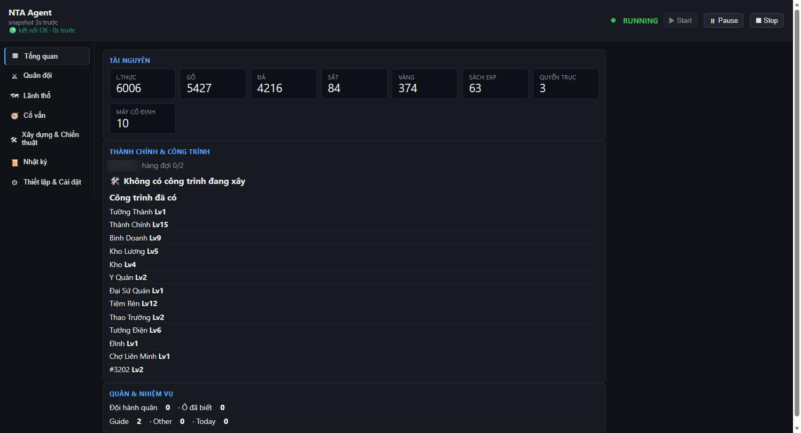
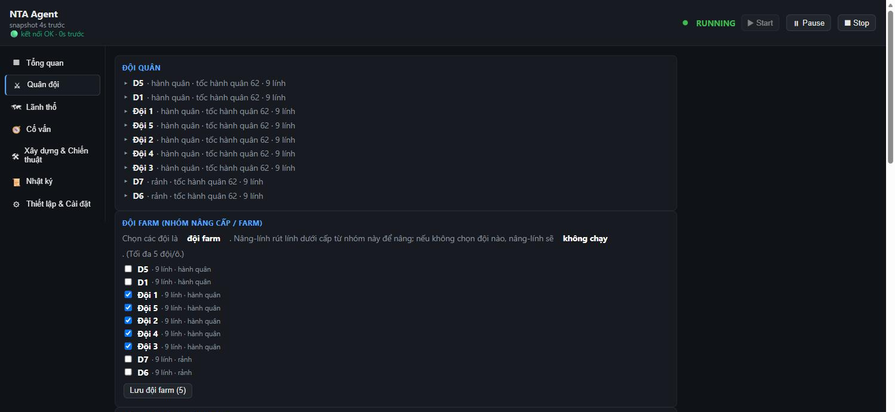
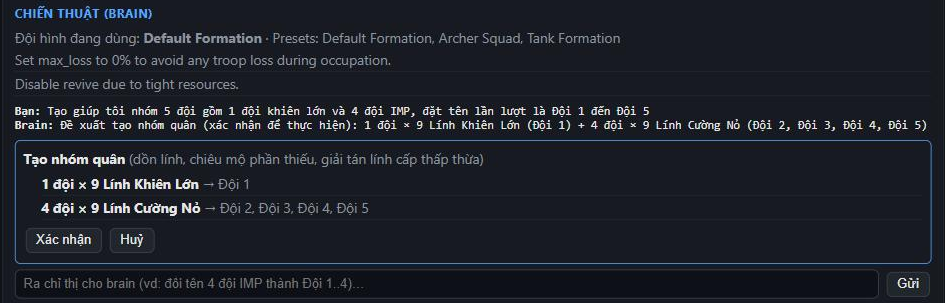
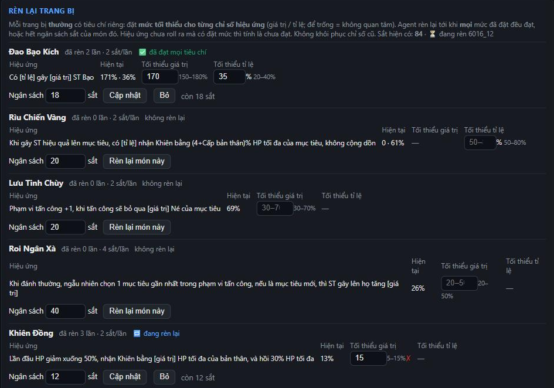
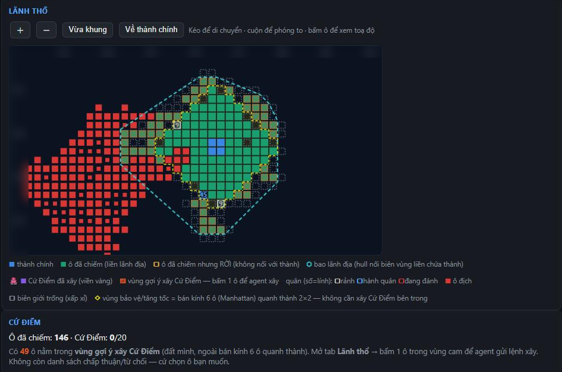
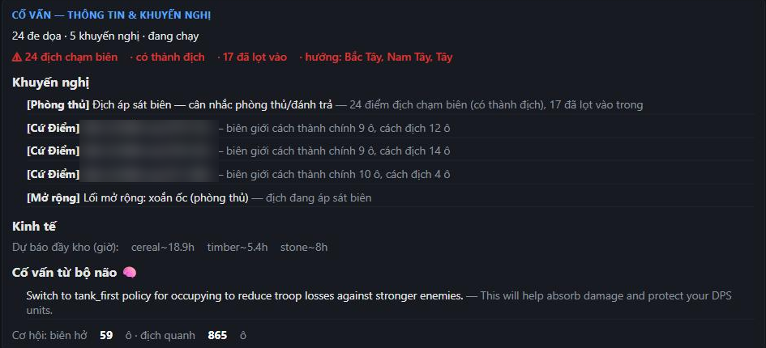
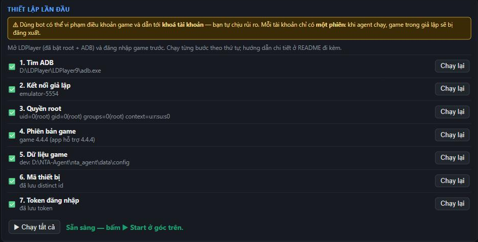

<div align="center">

**Tiếng Việt** · [English](README.en.md) · [中文](README.zh.md)

# NTA-Agent

**Trợ lý tự động chơi _Ninety Thousand Acres_: xây thành, chiếm đất, rèn đồ, gom quân, có bảng điều khiển trên trình duyệt.**

[](https://github.com/Relieq/NTA-Agent/releases/latest)




</div>

Agent nói chuyện **thẳng với máy chủ game** (không bấm màn hình), nên chạy nhẹ, nhanh và
không cần mở giả lập khi chạy hằng ngày. Mọi quyết định mạo hiểm đều theo giới hạn bạn đặt
(ví dụ "không tổn thất lính").

> ⚠ **Rủi ro:** dùng bot có thể vi phạm điều khoản của game và dẫn tới **khoá tài khoản**.
> Bạn tự chịu trách nhiệm khi dùng.
>
> ⚠ **Một phiên duy nhất:** khi agent chạy, game trong giả lập/điện thoại sẽ bị đăng xuất
> (và ngược lại). Muốn tự chơi thì bấm **⏹ Stop** trước.

---

## Tính năng

### 🏰 Tổng quan: tài nguyên, công trình, hàng đợi xây
Theo dõi lương thực, gỗ, đá, sắt, vàng… và tự nâng cấp công trình theo **thứ tự xây do bạn
sắp xếp** (kéo-thả, có thể bỏ qua công trình không muốn).

### ⚔ Quân đội và nhóm quân


- Chiếm ô quanh lãnh thổ bằng **mô phỏng trận đánh chính engine của game**: chỉ đánh khi
  dự đoán thắng trong giới hạn tổn thất bạn đặt.
- Tự chiêu mộ, hồi sinh, dồn lính cho đủ đội, nâng cấp lính bằng sách EXP.
- **Nâng lính bằng đội dư:** chọn nhóm đội + chế độ. Agent đề xuất đội dư (dùng lại đội lẻ, dồn lính,
  chiêu mộ, số sách/thời gian cần); bạn xác nhận. Đội dư nâng ở thành rồi ra **ô kề** đội chính **tráo
  lính cùng loại** — đội chính vẫn farm/dig (thiếu 1 đội thì chỉ đánh khi vẫn không mất lính).
- Chọn **đội farm** để agent quản lý riêng.

### 🧠 Chat với "bộ não" (tuỳ chọn, cần OpenAI key)


Ra lệnh bằng tiếng Việt, ví dụ _"Tạo nhóm 5 đội gồm 1 đội khiên lớn và 4 đội IMP, đặt tên
Đội 1 đến Đội 5"_. Bộ não đề xuất, **bạn bấm Xác nhận** thì agent mới làm: dồn lính từ các
đội hỗn hợp, chiêu mộ phần thiếu rồi tự đặt tên. Đổi tên đội, đổi chiến thuật… cũng làm qua chat.

### 🔨 Rèn lại trang bị theo tiêu chí


Đặt **mức tối thiểu cho từng chỉ số hiệu ứng** (có hiện khoảng roll được, ví dụ 150–180%)
và **ngân sách sắt** cho mỗi món. Agent rèn lại tới khi đạt, hoặc dừng khi hết ngân sách.

### 🗺 Lãnh thổ và Cứ Điểm


Bản đồ lãnh thổ trực tiếp: ô đã chiếm, biên giới, quân địch, vùng gợi ý xây **Cứ Điểm**
(bấm 1 ô là agent xây). Kiểu mở rộng xoắn ốc / bạch tuộc tuỳ tình hình địch.

**⛏ Dig tới một ô:** bấm ô bất kỳ trên bản đồ → *Dig tới đây*. Agent tính đường chiếm ô liên tiếp
nhanh nhất (hành quân + thời lượng trận theo bộ mô phỏng), giữ khoảng cách an toàn với địch, dự kiến
chỗ đặt Cứ Điểm (~7 ô một cái, ưu tiên đất cấp 1), rồi cho **xem trước** số ô / thời gian / thể lực.
Chỉ khi bạn bấm **Xác nhận** nhóm đội farm mới bắt đầu dig; các đội khác vẫn farm như thường. Đích bị
chiếm → tự đổi sang ô an toàn gần nhất; ô nào chưa thắng nổi trong giới hạn tổn thất → đi vòng, hoặc
chờ và báo cần chịu bao nhiêu % tổn thất.

### 🧭 Cố vấn và cảnh báo


Cảnh báo địch áp sát, dự báo kho đầy, khuyến nghị phòng thủ. Agent **ghi lại mọi trận mất
lính**, phát lại bằng mô phỏng để rút bài học (ví dụ nên cho đội nào đánh trước).

### ⚙ Thiết lập 7 bước, tự kiểm tra


Mỗi bước tự kiểm tra và hiện cách sửa nếu lỗi. Không cần cài Python hay Node: app đã kèm sẵn.

---

## Cài đặt (bản portable)

1. Tải **`NTA-Agent-<phiên bản>-full.zip`** từ [trang Releases](https://github.com/Relieq/NTA-Agent/releases/latest).
2. Giải nén vào một thư mục **bạn có quyền ghi**, ví dụ `D:\NTA-Agent\`
   (đừng để trong `C:\Program Files`).
3. Chạy **`NTA-Agent.exe`**. Trình duyệt sẽ mở bảng điều khiển tại `http://127.0.0.1:8787`.
   - Nếu Windows SmartScreen chặn: bấm **More info → Run anyway** (app chưa được ký số).
   - Nếu phần mềm diệt virus chặn `NTA-Agent.exe`: dùng **`NTA-Agent.bat`**, hai file làm y hệt nhau.
4. Lần đầu, bảng điều khiển mở tab **Thiết lập & Cài đặt**. Làm theo 7 bước bên dưới.
   Nút **▶ Start** bị khoá cho tới khi cả 7 bước đều ✅.

## Chuẩn bị trước

- **LDPlayer 9** (Android 9). Tải ở ldplayer.net. Chỉ cần cho lần thiết lập, xem
  [Dùng hằng ngày](#dung-hang-ngay).
- Game **Ninety Thousand Acres** đã cài trong LDPlayer, **đúng phiên bản app hỗ trợ**
  (xem bước 4).
- (Tuỳ chọn) **OpenAI API key** để bật "bộ não" chiến lược + chat.

---

## Các bước thiết lập

Ở tab **Thiết lập & Cài đặt**, bấm **▶ Chạy tất cả** hoặc chạy từng bước. Bước nào ❌ sẽ
hiện gợi ý sửa, sửa xong bấm **Chạy lại**.

<a id="buoc-1-adb"></a>
### Bước 1: Tìm ADB

App tự tìm `adb.exe` của LDPlayer (thường ở `D:\LDPlayer\LDPlayer9\adb.exe` hoặc
`C:\LDPlayer\LDPlayer9\adb.exe`). Nếu cài LDPlayer ở chỗ khác, nhập đường dẫn vào ô
**Đường dẫn adb.exe** trong phần Cài đặt rồi chạy lại.

<a id="buoc-2-gia-lap"></a>
### Bước 2: Kết nối giả lập

- Mở LDPlayer.
- Vào **Cài đặt LDPlayer → Khác → Gỡ lỗi ADB** và chọn **Mở kết nối cục bộ**.
- Nếu mở nhiều máy ảo, nhập đúng thiết bị (ví dụ `emulator-5554`) vào ô **Thiết bị ADB**.

<a id="buoc-3-root"></a>
### Bước 3: Quyền root

Vào **Cài đặt LDPlayer → Khác → Quyền ROOT = Bật**, lưu lại rồi **khởi động lại LDPlayer**.
App cần root để đọc mã thiết bị và token đăng nhập của game (chỉ đọc, không sửa gì).

<a id="buoc-4-game"></a>
### Bước 4: Phiên bản game

App kiểm tra phiên bản game đang cài có khớp với bản app hỗ trợ không. Lệch phiên bản có thể
khiến agent gửi lệnh sai. Nếu game vừa cập nhật mà app chưa có bản mới, bạn có thể bấm
**Bỏ qua** (tự chịu rủi ro) hoặc chờ bản cập nhật của app.

<a id="buoc-5-du-lieu-game"></a>
### Bước 5: Dữ liệu game

App **không** kèm dữ liệu của game. Bước này lấy file cài đặt game (APK) **từ chính giả lập
của bạn**, rồi giải mã giao thức, các bảng số liệu và engine trận đánh vào thư mục dữ liệu
riêng của bạn.

- Khoá giải mã được **tự tìm trong chính bản game của bạn**, bạn không cần nhập gì.
- Mất khoảng 10–30 giây. Phải **dừng agent** trước khi chạy lại bước này.
- Khi game cập nhật phiên bản, hãy chạy lại bước này.

<a id="buoc-6-distinct-id"></a>
### Bước 6: Mã thiết bị

Đọc mã thiết bị mà game dùng khi đăng nhập. Nếu lỗi, hãy mở game một lần cho tới màn hình
chính rồi chạy lại.

<a id="buoc-7-token"></a>
### Bước 7: Token đăng nhập

1. Trong LDPlayer, mở game và **đăng nhập** (Google/Facebook…).
2. **Thoát game** (vuốt tắt hẳn).
3. Chạy lại bước này. Phải dừng agent trước.

Khi đủ 7 bước ✅, bấm **▶ Start** ở góc trên.

---

<a id="dung-hang-ngay"></a>
## Dùng hằng ngày

### Có cần bật LDPlayer không?

**Không.** Agent nói chuyện thẳng với máy chủ game, nên khi chạy bình thường bạn có thể tắt
LDPlayer (tiết kiệm khoảng 1.7 GB RAM).

Token đăng nhập của game chỉ dùng được một lần: mỗi lần agent đăng nhập, máy chủ trả token
mới và agent tự lưu lại cho lần sau. Nhờ vậy khởi động lại agent hay khởi động lại máy đều
không cần LDPlayer.

Chỉ cần LDPlayer khi:

| Trường hợp | Làm gì |
|---|---|
| Thiết lập lần đầu, hoặc game cập nhật | Chạy các bước ở tab Thiết lập (bước 5 trích lại dữ liệu game). |
| **Chuỗi token bị đứt**, thường là sau khi bạn tự vào game (giả lập hay điện thoại) | Nếu LDPlayer đang mở, agent tự lấy token mới. Nếu không, agent chuyển **CRASHED**: mở LDPlayer, đăng nhập game, thoát hẳn game, chạy lại bước 7 rồi bấm Start. |
| Bạn muốn tự chơi | Bấm **⏹ Stop** agent trước (chỉ một phiên được đăng nhập). |

### Khởi động lại

- **Khởi động lại dashboard:** agent vẫn chạy tiếp; dashboard mới tự nhận lại agent.
- **Khởi động lại máy:** không có gì tự bật lại. Chạy `NTA-Agent.exe` rồi bấm **▶ Start**.
  Agent đăng nhập bằng token đã lưu.
- Nếu agent chuyển **CRASHED**, bấm **📄 Xem lỗi** cạnh nút Start để xem nguyên nhân.

### Tốn bao nhiêu RAM?

Đo thực tế trên máy Windows 11:

| Thành phần | RAM |
|---|---|
| Mô phỏng trận (Node, chạy engine trận của game) | ~380 MB |
| Agent (Python) | ~45 MB |
| Dashboard (Python) | ~40 MB |
| **Tổng** | **~0.5 GB** |
| _(LDPlayer, khi mở)_ | _~1.7 GB, không cần khi chạy hằng ngày_ |

---

## Cài đặt (tab Thiết lập & Cài đặt)

| Mục | Ý nghĩa |
|---|---|
| OpenAI API key | Tuỳ chọn. Bật bộ não chiến lược + chat. Tính phí vào tài khoản OpenAI của bạn; nút **Kiểm tra OpenAI key** thử key miễn phí. |
| Model / Giới hạn lượt gọi | Chọn model từ danh sách lấy theo tài khoản OpenAI của bạn (mặc định `gpt-4o-mini`) và số lần gọi tối đa mỗi phiên. |
| XXTEA key | Để trống: app tự tìm khoá trong bản game của bạn. Chỉ nhập khi bước 5 báo không tìm được. |
| adb.exe / Thiết bị ADB | Chỉ cần khi app không tự dò được. |

Key được **mã hoá bằng tài khoản Windows của bạn**: copy file sang máy khác sẽ không đọc
được. Bảng điều khiển không bao giờ hiện lại key đầy đủ.

## Cập nhật

- Khi có bản mới, thanh xanh **⬆ Có bản mới** hiện trên cùng. Bấm **Cập nhật**: agent dừng,
  app tải bản mới (kiểm tra checksum), tự khởi động lại sau khoảng 1 phút.
- Nếu bản mới không khởi động được, app **tự quay về** bản cũ.
- Muốn quay về bản trước bằng tay: phần Cài đặt → **↩ Quay về bản trước**
  (app giữ 2 bản gần nhất).
- Cập nhật không đụng tới dữ liệu, key và cài đặt của bạn.

## Dữ liệu nằm ở đâu

Mọi thứ của riêng bạn nằm ở `%LOCALAPPDATA%\NTA-Agent\`:

- `settings.json`: cài đặt, key đã mã hoá
- `token.txt`: token đăng nhập game
- `gamedata\`: dữ liệu game trích từ APK của bạn
- `run\`: trạng thái agent, nhật ký (`agent.log`, `errors.jsonl`)
- `backups\`: các bản app cũ

**Gỡ cài đặt:** xoá thư mục app và thư mục `%LOCALAPPDATA%\NTA-Agent`.

## Xử lý sự cố

| Hiện tượng | Cách xử lý |
|---|---|
| Trình duyệt không mở | Tự mở `http://127.0.0.1:8787`. Nếu cổng bận, app chuyển sang 8788, 8789… |
| Start báo "Chưa hoàn tất Thiết lập" | Mở tab Thiết lập, chạy các bước còn ❌. |
| Agent chuyển sang CRASHED | Bấm **📄 Xem lỗi**, hoặc xem `run\agent.log` và `run\errors.jsonl`. Lỗi token: xem [Dùng hằng ngày](#dung-hang-ngay). |
| Game trong giả lập bị đăng xuất | Bình thường: agent và game dùng chung một phiên. |
| Đổi tên đội chưa thấy tác dụng | Game chỉ cho đổi tên khi đội rảnh; agent tự thử lại khi đội về. |
| Bước 5 báo "không tìm được khoá" | Game có thể đã đổi cách lưu khoá: báo người chia sẻ app, hoặc nhập XXTEA key thủ công ở Cài đặt. |

---

## Dành cho người phát triển

Mã nguồn Python 3.12 (venv `.venv`), sidecar mô phỏng trận Node ≥ 18. Kiến trúc và lộ trình
nằm trong `docs/ROADMAP.md`; ghi chú vận hành cho agent nằm trong `CLAUDE.md`.

```bash
.venv/Scripts/python.exe -m pytest -q                  # test
.venv/Scripts/python.exe -m ruff check nta_agent tests # lint
.venv/Scripts/python.exe tools/launch_detached.py dashboard   # chạy dashboard (dev)
```

Đóng gói bản phát hành (commit trước, vì chỉ file đã được git theo dõi mới được đóng gói):

```bash
.venv/Scripts/python.exe tools/package.py --version 0.1.0 --notes "..."
# -> dist/NTA-Agent-<v>-full.zip, dist/NTA-Agent-<v>-app.zip, dist/manifest.json
gh release create v0.1.0 dist/NTA-Agent-0.1.0-full.zip dist/NTA-Agent-0.1.0-app.zip dist/manifest.json
```

App tự cập nhật bằng cách đọc `releases/latest` của repo này. Bản `app` (nhỏ) được dùng khi
runtime (Python/Node) không đổi, ngược lại dùng bản `full`.
